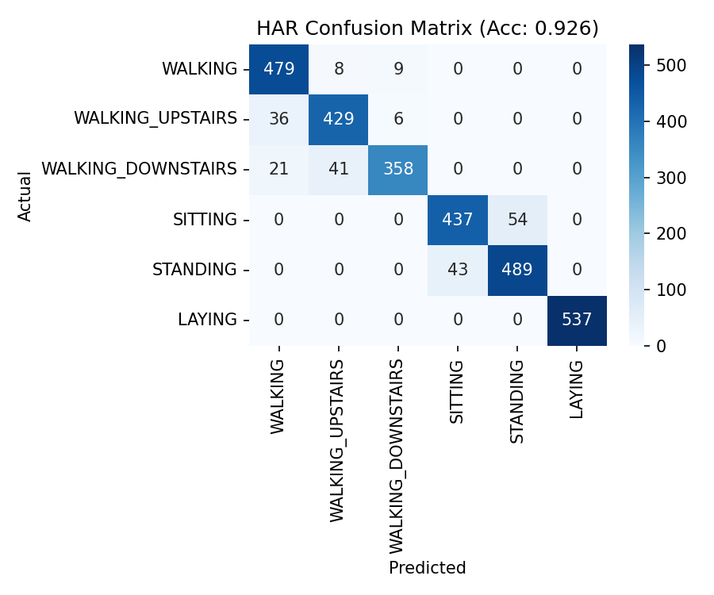
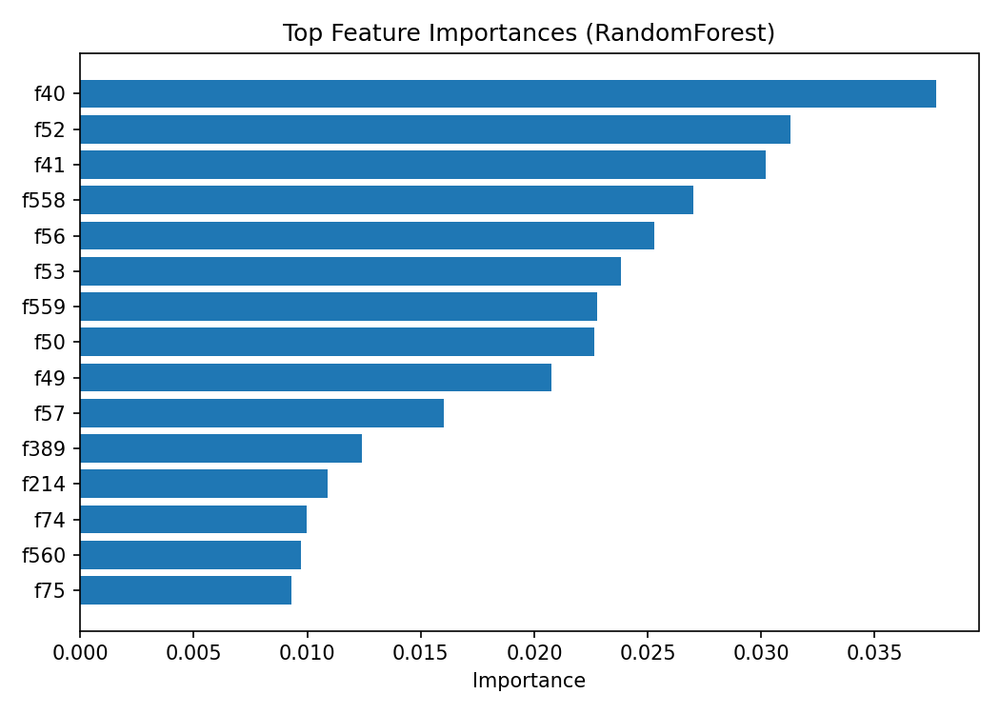

# 🏃‍♂️ Fitness Activity Classifier (HAR)

Classifies human activities (walking, sitting, standing, laying, stairs) from wearable sensor features (UCI HAR).  
Tech: Python, scikit-learn, RandomForest.


## Quick start
```bash
python -m venv venv && .\venv\Scripts\Activate
pip install -r requirements.txt
python src/get_data.py
python src/train.py

## 📂 Project Structure

fitness-activity-classifier/
├── data/
│ ├── raw/ # downloaded dataset (ignored in Git)
│ └── processed/ # processed features
├── notebooks/
│ └── har_model.ipynb # Jupyter notebook
├── src/
│ ├── get_data.py # script to download/extract dataset
│ └── train.py # script to train model & save outputs
├── tests/
│ └── test_train.py # simple accuracy test
├── outputs/ # confusion matrix, trained model
├── requirements.txt # Python dependencies
├── LICENSE # license text (MIT)
├── .gitignore # files/folders Git ignores
└── README.md # this file

## Results
Achieved ~90–95% accuracy on the UCI HAR test set.



[Full classification report](outputs/classification_report.txt)

## Project Structure
fitness-activity-classifier/
├── data/
│ ├── raw/ # downloaded dataset (ignored in Git)
│ └── processed/
├── notebooks/
│ └── har_model.ipynb
├── src/
│ ├── get_data.py
│ └── train.py
├── tests/
│ └── test_train.py
├── outputs/
│ └── confusion_matrix.png # tracked (model artifact ignored)
├── requirements.txt
├── LICENSE
├── .gitignore
└── README.md

## Results

**Model:** RandomForestClassifier (300 trees, random_state=42)  
**Test accuracy:** ~94% on the UCI HAR dataset

| Metric   | Value |
|---------:|:-----:|
| Accuracy | 0.94  |

### Confusion Matrix


### Feature Importances


👉 [View full classification report](outputs/classification_report.txt)

